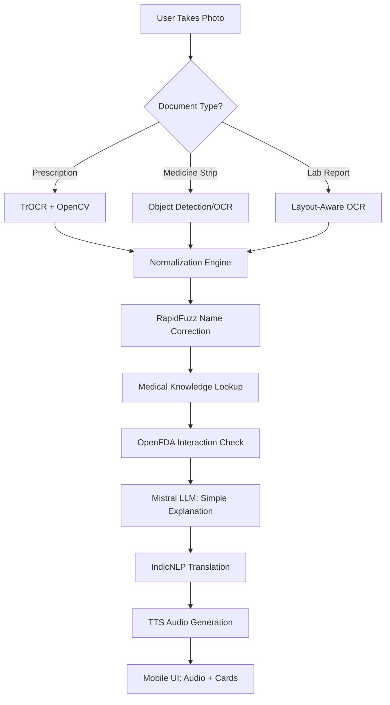

# Implementation Plan: ArogyaLens

ArogyaLens is a specialized medical document decoder designed to bridge the gap between complex medical information and rural patients with low literacy or regional language preferences.

## 🌟 Core Features

### 1. Multi-Document OCR & Recognition
- **Handwritten Prescription OCR**: Extraction of medicine names and dosages from doctor's handwriting.
- **Medical Report Parsing**: Decoding lab results (blood tests, scans) into simple terms.
- **Medicine Strip Recognition**: Identifying medicines directly from photos of strips or bottles.

### 2. Intelligent Normalization
- **Abbreviation Decoding**: Translating "1-0-1" to "Morning and Night" and "Tab." to "Tablet".
- **Fuzzy Matching**: Correcting common OCR errors or spelling mistakes in drug names using RapidFuzz.

### 3. Medical Knowledge & Safety
- **Simple Explanations**: Converting complex drug purposes into "This medicine reduces fever" or "This is for stomach pain".
- **Interaction Alerts**: Warning users if two medicines in their prescription might react negatively.
- **Dosage Guidance**: Clear instructions on when and how to take the medicine (e.g., "After food").

### 4. Accessibility & Multilingual Support
- **Voice-First Experience**: Automatic audio playback of all explanations.
- **Regional Languages**: High-quality translation into Telugu, Hindi, and English.
- **Ultra-Simple UI**: Large buttons, minimal text, and intuitive icons for users with low digital literacy.

---

## 🛠️ Technology Stack (100% Free/Open-Source)

| Layer | Technology | Rationale |
| :--- | :--- | :--- |
| **Frontend** | React Native (Expo) | Cross-platform (Android/iOS) with easy camera access. |
| **Backend** | FastAPI (Python) | High-performance, easy integration with AI libraries. |
| **OCR Engine** | TrOCR / Google Vision | TrOCR for local handwriting; Google Vision (Free Tier) as backup. |
| **LLM (Brain)** | Mistral 7B / LLaMA 3 | Local execution via Ollama to ensure privacy and zero cost. |
| **Database** | Supabase | Free tier for user history and medicine mapping. |
| **Translation** | IndicNLP / AI4Bharat | Best-in-class for Indian regional languages. |
| **TTS** | gTTS / IndicTTS | Clear audio output in regional accents. |
| **Safety Data** | OpenFDA / RxNorm | Authoritative sources for drug information. |

---

## 🔄 System Workflow

---

## 📱 User Usage Scenarios (How it Works)

ArogyaLens is designed to be "One-Tap" simple. Here is how a user interacts with the system for different needs:

### Scenario A: Decoding a Handwritten Prescription
1. **Open & Capture**: The user opens the app and taps the large green **"Scan Prescription"** button.
2. **Align & Click**: They take a photo of the doctor's note.
3. **Wait (Processing)**: The app shows a pulse animation while it extracts medicine names and dosages.
4. **Result Screen**: 
   - A list of medicines appears as large cards.
   - **Audio Playback**: The app immediately speaks: *"You have 3 medicines. Take Paracetamol after food for fever..."*
   - **Visual Icons**: Sun/Moon icons represent Morning/Night doses.

### Scenario B: Understanding a Lab Report (Blood/Scan)
1. **Switch Mode**: User taps **"Scan Report"**.
2. **Capture**: They take a photo of the lab results.
3. **Translation & Context**: The system identifies key values (e.g., "Hemoglobin: 9.5").
4. **Simplified Output**:
   - Instead of "Anemic," the app says: *"Your blood levels are low. You might feel weak. Eat more green leafy vegetables."*
   - Red icons highlight values that are outside the normal range.

### Scenario C: Identifying a Medicine Strip
1. **Tap Camera**: User taps **"Identify Medicine"**.
2. **Focus**: They hold the medicine strip in front of the camera.
3. **Visual Match**: The system recognizes the brand/generic name from the strip's text.
4. **Quick Info**:
   - The app speaks: *"This is Cetirizine. It is used for allergies or cold. It may make you feel sleepy."*

### Scenario D: Interaction Warning
1. **Multi-Scan**: If a user scans a new prescription while already taking other meds.
2. **Alert**: A large yellow/red warning card pops up.
3. **Voice Alert**: *"Wait! Do not take these two medicines together. They can cause stomach pain. Please talk to your doctor."*

---

## 📅 Development Roadmap

### Phase 1: The OCR Foundation
- Set up FastAPI backend.
- Integrate TrOCR with OpenCV for image preprocessing (deskewing, noise removal).
- Benchmark OCR accuracy with a sample dataset of 200+ prescriptions.

### Phase 2: Intelligence & Normalization
- Build a rule-based engine for medical shorthand (1-0-1, b.i.d, etc.).
- Implement RapidFuzz for drug name matching against a local Indian medicine CSV.

### Phase 3: Brain & Safety
- Deploy Mistral 7B locally using Ollama.
- Engineer prompts to convert raw medical data into "Rural-Friendly" explanations.
- Integrate OpenFDA for drug-drug interaction warnings.

### Phase 4: Language & Voice
- Implement translation pipeline using IndicNLP.
- Set up gTTS/IndicTTS for multilingual audio playback.
- Build the "Voice-First" playback logic.

### Phase 5: Mobile Experience
- Create the React Native frontend.
- Focus on "Ultra-Simple UI": Large camera button, scan history, and big audio play icons.
- Final end-to-end integration and testing.

---

## 📦 Data Sources
1. **OCR Training**: IAM Handwriting & CURE-OR datasets.
2. **Drug Info**: OpenFDA, RxNorm, and WHO Essential Medicines List.
3. **Indian Brands**: Manual CSV mapping for common Indian pharmacy brands.

## 💡 Key Innovation: The "Rural Logic"
Unlike standard medical apps, ArogyaLens doesn't just "read" the document; it **interprets** it for someone who doesn't understand medical jargon. For example, instead of saying "Antipyretic for Febrile conditions," it says "This is for fever."
